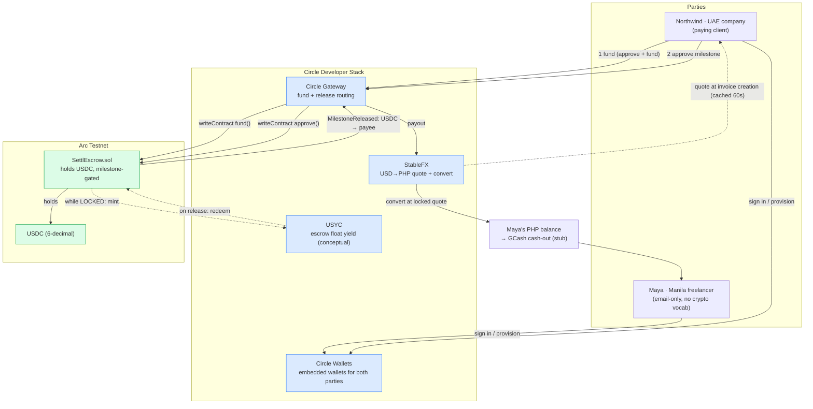
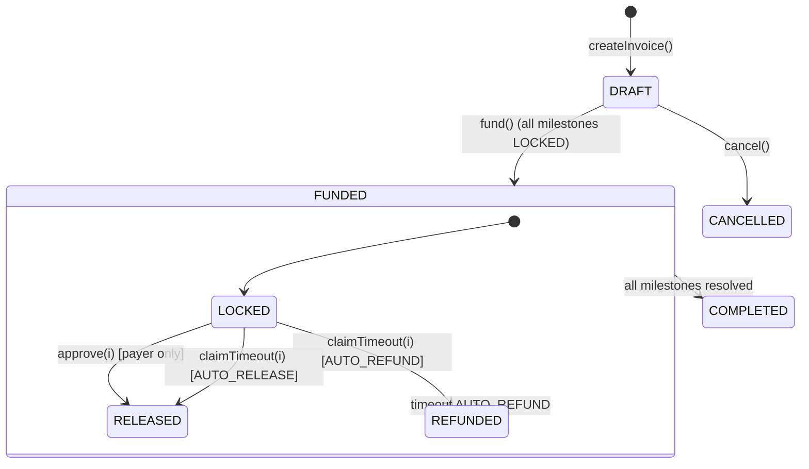

# Settl — Architecture (T8.3)

One Mermaid diagram covering the full path: Circle Wallets → SettlEscrow on Arc → Gateway → StableFX → USYC float → PHP off-ramp, plus the milestone state machine. Renders on GitHub. Matches the running app (`src/lib/escrow.ts`, `fx.ts`, `convert.ts`, `usyc.ts`).

## System flow

## Milestone state machine

## Where each piece lives in code

| Step | Code | Circle product |
| ---- | ---- | -------------- |
| Wallet provisioning | (Wallets seam in `escrow.ts#walletClient`) | Circle Wallets |
| Quote at invoice creation | `lib/fx.ts#getUsdToPhpQuote` → `FXQuote(source=stablefx)` | StableFX |
| On-chain register | `lib/escrow.ts#createInvoiceOnChain` | — |
| Fund | `api/invoices/[id]/fund` → `escrow.ts#fundEscrow` (Gateway seam) | Wallets + Gateway + USDC |
| Float yield while LOCKED | `lib/usyc.ts#routeToUSYC` | USYC (conceptual) |
| Approve / release | `client/invoices/[id]` action → `escrow.ts#approveMilestone` (Gateway seam) | Gateway + USDC |
| Convert on release | `lib/convert.ts#convertUSDCtoPHP` (references locked quote id) | StableFX |
| Reconciliation | `lib/listener.ts#startEventListener` (viem watchContractEvent) | — |
| Receipt tx trail | `client/invoices/[id]/receipt` (explorer-linked hashes) | — |

> **Unit note:** the app's USD minor units are cents (2 decimals); the contract speaks 6-decimal USDC. `lib/money.ts#centsToUsdc` converts at every contract boundary.
